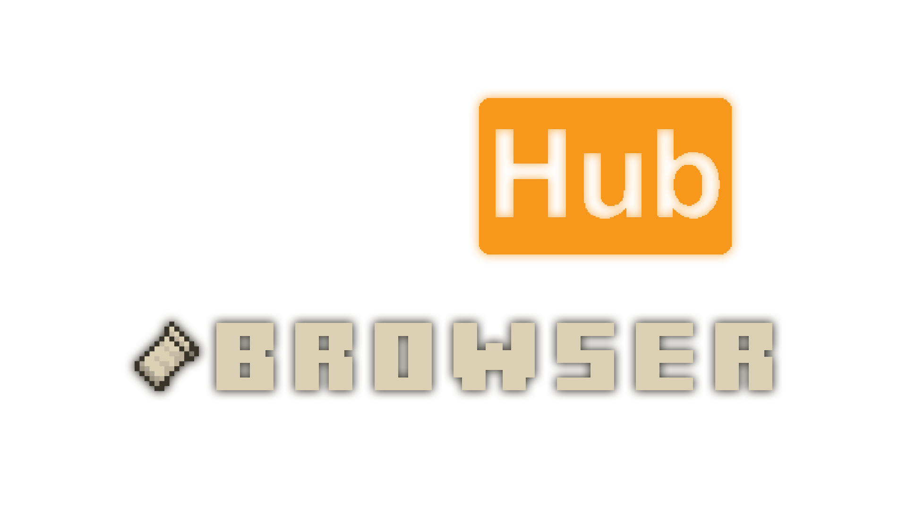

<!-- PROJECT LOGO -->
 

  

<h3 align="center">Pack Browser</h3>

  

    Download packs directly to you game. No faffing.
     
     
    <a href="https://github.com/Matt-MX/AnnouncerVelocity/releases"><strong>Download »</strong></a>
     
     
    <a href="https://github.com/Matt-MX/AnnouncerVelocity/issues">Report Bug</a>
    ·
    <a href="https://github.com/Matt-MX/AnnouncerVelocity/issues">Request Feature</a>
  

<!-- ABOUT THE PROJECT -->
## Features

- Manage your texture packs easily. We remove the faff for you.
- Install packs directly to your game via an in-game pack browser (thanks to PackHub's API).
- Utilities to make managing your packs easier.

## To Do

- [x] Let users browse packs in game 
- [ ] Let users install packs to the game directly 
- [ ] Pack Manager 
  - [ ] Option: Automatically deselect outdated packs
  - [ ] Option: Version converter
  - [ ] Drag and Drop GUI
  - [ ] Smart folder manager
  - [ ] Ability to search packs by tags (If they are PackHub registered packs)

(<a href="#top">back to top</a>)

